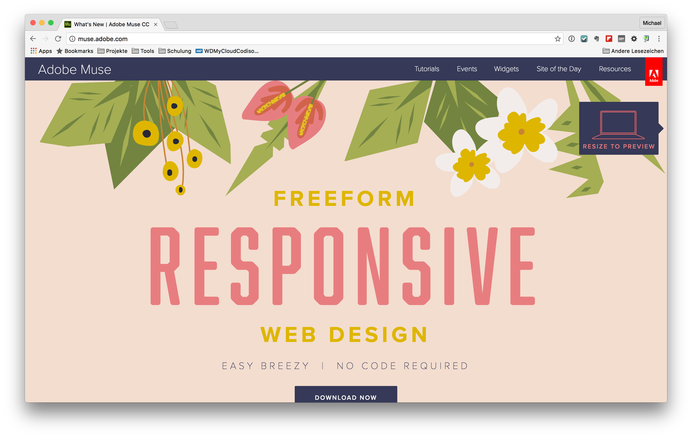

# Adobe Muse CC
Mit Adobe Muse CC hat Adobe einen sehr guten Visual Builder für responsive Websites am Markt. Dieser bietet ein freies rahmenorientiertes Layouten ohne Verwendung eines Grid-Systems. Adobe Muse CC ist Bestandteil der [Adobe Creative Cloud](http://www.adobe.com/de/creativecloud.html).

Genaue Informationen zu Adobe Muse CC findet man unter:

* [Homepage des Produktes](http://muse.adobe.com/)
* [Resourcen zu Adobe Muse CC](http://resources.muse.adobe.com/collections/resources)
* [Video Tutorials in Adobe TV](http://tv.adobe.com/de/product/muse/)

