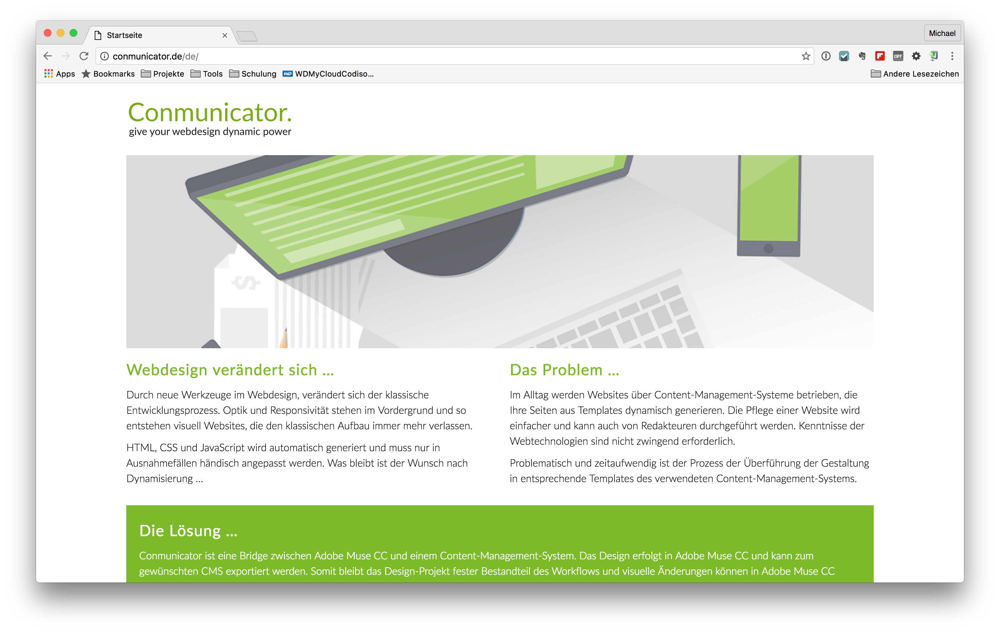

# Conmunicator

Conmunicator ist eine Bridge zwischen Adobe Muse CC und einem Content-Management-System. Das Design erfolgt in Adobe Muse CC und kann zum gewünschten CMS exportiert werden.

Somit bleibt das Design-Projekt fester Bestandteil des Workflows und visuelle Änderungen können weiterhin in Adobe Muse CC durchgeführt werden, ohne den Anschluss an das CMS zu verlieren.

Der dynamische Inhalt wird über das CMS zur Verfügung gestellt. Das individuelle Erstellen von selbsprogrammierten Templates, innerhalb des genutzten CMS, entfällt.

Informations zum Conmunicator:
* [Homepage](http://www.conmunicator.de/)