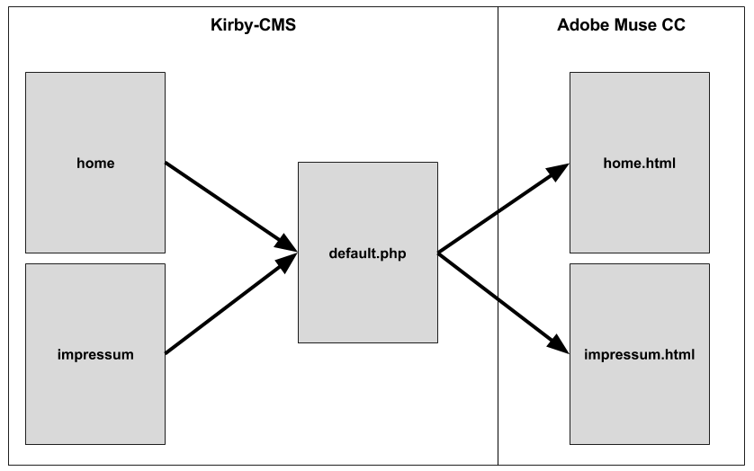
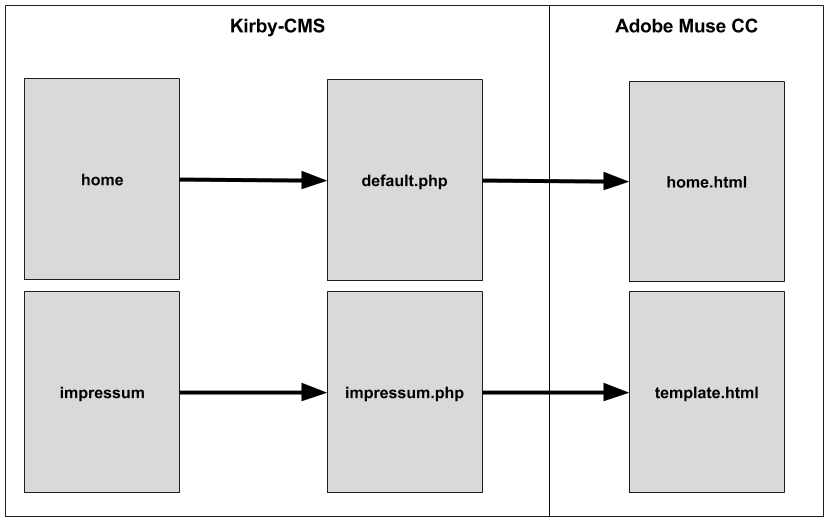

# Templates

Die Verbindung zwischen Kirby und dem Conmunicator erfolgt über Templates. Kirby besitzt unter "**site/templates/**" ein Standard-Template mit dem Namen "**default.php**".

Über dieses Template werden die Seiten aus dem CMS ausgegeben, sofern kein spezielles Template für eine Seite angelegt wurde.

Hat man man den Conmunicator installiert, so wurde das Standard-Template durch eine entsprechend angepasste Version ersetzt.

## Verbindungen

Die Verbindung zwischen den einzelnen Adobe Muse CC Seiten erfolgt im Standardfall über den Seitennamen. Besitzt Kirby eine Seite "**impressum**", so wird die entsprechende Adobe Muse CC Seite "**impressum.html**" referenziert.

Dies entspricht einem 1:1 Matching, welches voraussetzt, dass jede Seite in Kirby eine entsprechende korrespondierende Seite in Adobe Muse CC besitzt. Für kleine bis mittlere Websites ist dies ein guter Weg um Inhalte schnell und unkompliziert zu dynamisieren.



Wird eine Website deutlich umfangreicher, so kann eine alternative Variante genutzt werden. Hierbei fungiert Adobe Muse CC als Template-Generator für das genutzte CMS.

Durch spezielle Templates in Kirby, welche Kopien der ursprünglichen Datei "**default.php**" sind, wird es möglich einzelnen Seiten in Kirby ein eigenes Template zuzuweisen. Hierzu ist die Kopie entsprechend dem Seitennamen umzubenennen.

Editiert man das duplizierte Template, so ist es möglich eine feste Verbindung mit einer Adobe Muse CC Seite herbeizuführen, indem das Attribut "**templateFile**" ensprechend mit einem festen Dateinamen belegt wird.

```php
<
?php
//==================================================================================
// impressum.php
//----------------------------------------------------------------------------------
// Conmunicator. – Integrating Adobe Muse CC with a CMS
//==================================================================================
session_start();

$cmu["themePath"] = "conmunicator/export/";
$cmu["dir"] = $cmu["themePath"]."muse/";
$cmu["conf"] = array(
                      "templateFile" => "template.html",
                      "stripComments" => true,
                      "useContaoJQuery" => false,
                      "centerPage" => false,
                    );
                      
include("conmunicator/core/conmunicator.php");
?>
```



Alle Seiten außer die Seite Impressum würden über das Default-Template mit 1:1 Matching ausgegeben. Die Seite Impressum hat eine eigene korrespondierende Seite und nutzt explizit diese zur Ausgabe.
