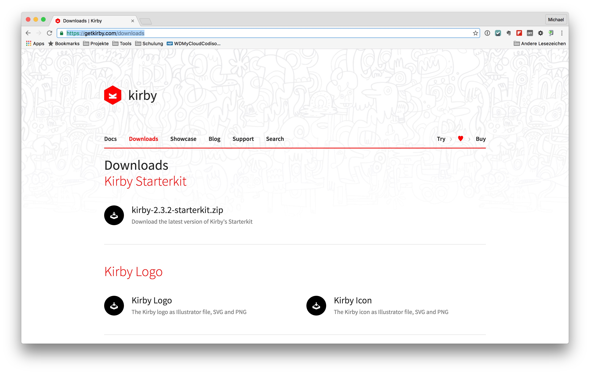

# Das Kirby-CMS

Kirby ist ein kostenpflichtiges dateibasiertes CMS, welches ohne den Einsatz einer Datenbank auskommt. Es ist dadurch sehr schnell und auch auf einem schmalbrüstigen Web-Space sehr gut zu betreiben.

Dennoch bietet Kirby viele Funktionalitäten um eine Website entsprechend zu verwalten. Strukturen werden durch Ordner abgebildet und Inhalte beruhen auf Dateien, die diesen zur Verfügung stellen. Der Kirby eigene Slogan "Easy to setup. Easy to use. Flexible as hell." beschreibt das CMS wohl am Besten.

## Die Installation
Kirby kann als ZIP-Datei heruntergeladen werden und steht so schnell zur Installation bereit. Die entsprechenden Downloads findet man unter [https://getkirby.com/downloads](https://getkirby.com/downloads).

Eine genaue Beschreibung der Installation ist in der Kirby [Dokumentation](https://getkirby.com/docs/installation) enthalten. Mit dieser sind die einzelnen Schritte der Installation problemlos durchzuführen.

Kirby kann problemlos mit MAMP oder XAMPP lokal betrieben werden. Für einen Betrieb auf einem Live-Server ist eine Lizenz notwendig.

