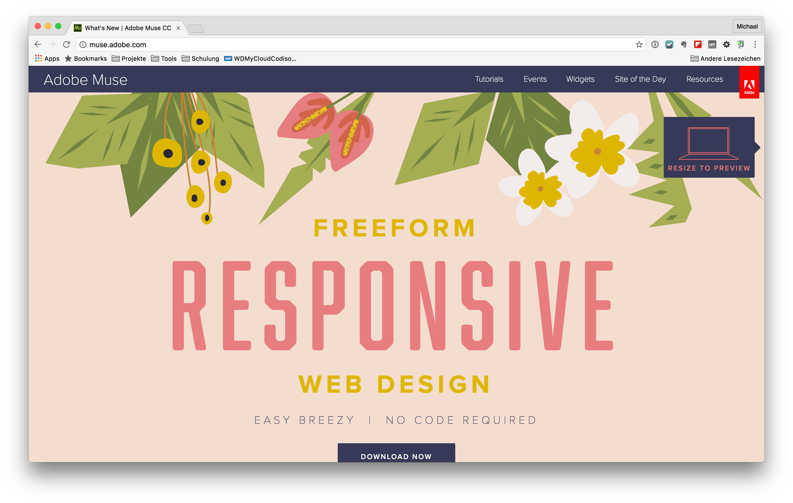

# Adobe Muse CC
Adobe has with it's product Adobe Muse CC a very good visual builder for responsive web design on the market. This tool is a website builder with a frame based layout. There is no need for any grid system.

Adobe muse CC is a member of the Adobe Creative Cloud and integrates with other Adobe products.

Genaue Informationen zu Adobe Muse CC findet man unter:

* [Homepage des Produktes](http://muse.adobe.com/)
* [Resourcen zum Produkt](http://resources.muse.adobe.com/collections/resources)
* [Video Tutorials in Adobe TV](http://tv.adobe.com/de/product/muse/)
* [Videos unter YouTube](https://www.youtube.com/results?search_query=adobe+muse) 
* [Tutorials](https://helpx.adobe.com/de/muse/tutorials.html)
* [Forum](https://forums.adobe.com/community/muse)

