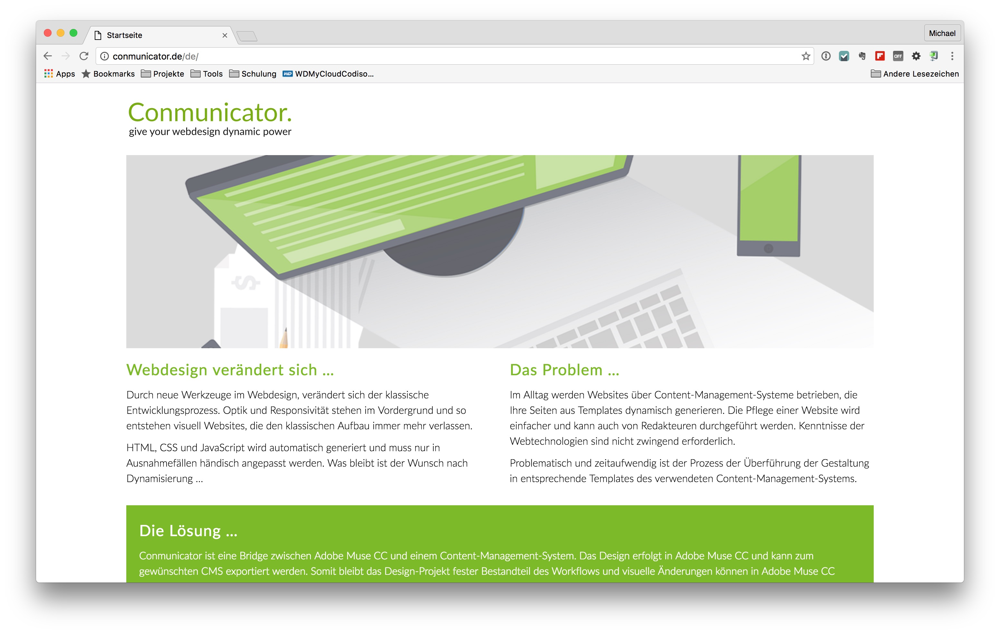

# Install Conmunicator
To install Conmunicator, you must download the latest version from [http://www.conmunicator.com/](http://www.conmunicator.com/). On the Homepage you will find a link to the actual download version, for your CMS.

After downloading you will find the .zip archive in your download folder. Unpack the archive, and the shown file structure is present in the folder.

BILD

Copy the folder named "communicator" to the root directory of your Contao installation. Copy the file "**default.php**" to the subdirectory **/site/templates**.

BILD

The Conmunicator is now ready for local use. For an operation on a top-level domain, you need an appropriate [license](lizenzen.md).