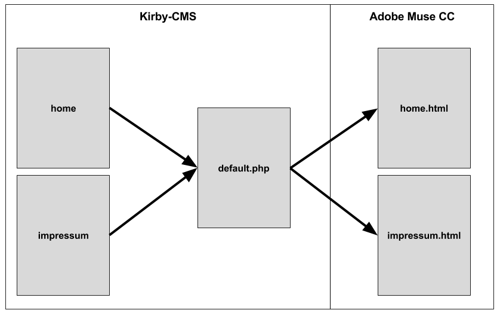

# Templates
Die Verbindung zwischen Kirby und dem Conmunicator erfolgt über Templates. Kirby besitzt unter "**site/templates/**" ein Standard-Template mit dem namen "default.php".

Über dieses Template werden die Seiten aus dem CMS ausgegeben, sofern kein spezielles Template für eine Seite angelegt ist.

Hat man man den Conmunicator installiert, so wurde das Standard-Template durch eine entsprechend angepasste Version ersetzt.

## Verbindungen
Die Verbindung zwischen den einzelnen Adobe Muse CC Seiten erfolgt im Standardfall über den Seitennamen. Besitzt Kirby eine Seite "**impressum**", so wird die entsprechende Adobe Muse CC Seite "**impressum.html**" referenziert.

Dies entspricht einem 1:1 Matching, welches voraussetzt, dass jede Seite in Kirby eine entsprechende korrespondierende Seite in Adobe Muse CC besitzt. Für kleine bis mittlere Websites ist dies ein guter Weg.



Wird eine Website deutlich umfangreicher, so kann eine alternative Variante genutzt werden. Hierzu wird Adobe Muse CC zum Template-Generator für das CMS.

Durch spezielle Templates in Kirby, welche Kopien der ursprünglichen Datei "**default.php**" sind, wird es möglich einzelnen Seiten in Kirby ein eigenes Template zuzuweisen. Hierzu ist die Kopie entsprechend dem Seitennamen umzubenennen.

Editiert man das duplizierte Template, so ist es möglich eine feste Verbindung mit einer Adobe Muse CC Seite herbeizuführen, indem das Attribut "**templateFile**" ensprechend belegt wird.

```php
<?php
//==================================================================================
// impressum.php
//----------------------------------------------------------------------------------
// Conmunicator. – Integrating Adobe Muse CC with a CMS
//==================================================================================
session_start();

$cmu["themePath"] 	= "conmunicator/export/";
$cmu["dir"] 		= $cmu["themePath"]."muse/";
$cmu["conf"] 		= array(
							"templateFile" => "template.html",
							"stripComments" => true,
							"replaceJQuery"	=> false,
							"centerPage" => false,
						);

include("conmunicator/core/conmunicator.php");
?>
```


Every page exept the imprint, will be delivered by 1:1 matching using the default template.  The imprint page has it's own template and uses this explicitly.
