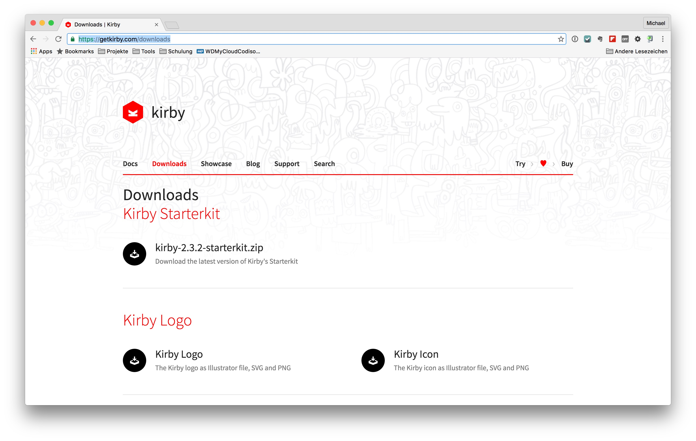
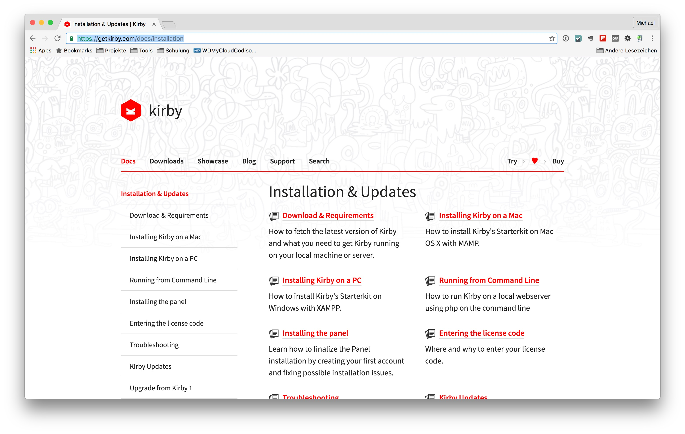

# The Kirby-CMS

Kirby is a file-based CMS, which does not require the use of a database. It is not a open source system but very easy to use, fast and it works also with smaller webspaces.

Nevertheless, Kirby has a number of features which can be used with a website . Structures are represented by folders and content is based on flat files that make these available. The Kirby own slogan "Easy to setup. Easy to use. Flexible as hell." describes the CMS probably best.

## The Installation
Kirby can be downloaded as a ZIP file and is quickly ready for installation. The corresponding downloads can be found at
[https://getkirby.com/downloads](https://getkirby.com/downloads).

A detailed description of the installation can be found in the Kirby [documentation](https://getkirby.com/docs/installation).

Kirby kann problemlos mit [MAMP](https://www.mamp.info) oder [XAMPP](https://www.apachefriends.org/) lokal betrieben werden. Für einen Betrieb auf einem Live-Server ist eine Lizenz notwendig. Die [Kosten](https://getkirby.com/buy) sind erschwinglich und sollten nicht vor einem Einsatz von Kirby abschrecken.

Kirby can easily be used with [MAMP](https://www.mamp.info) or [XAMPP](https://www.apachefriends.org/) for local operation. If you whant it to work on a live server a license is necessary . The [cost](https://getkirby.com/buy) for a licence is affordable and should not discourage the use of Kirby.